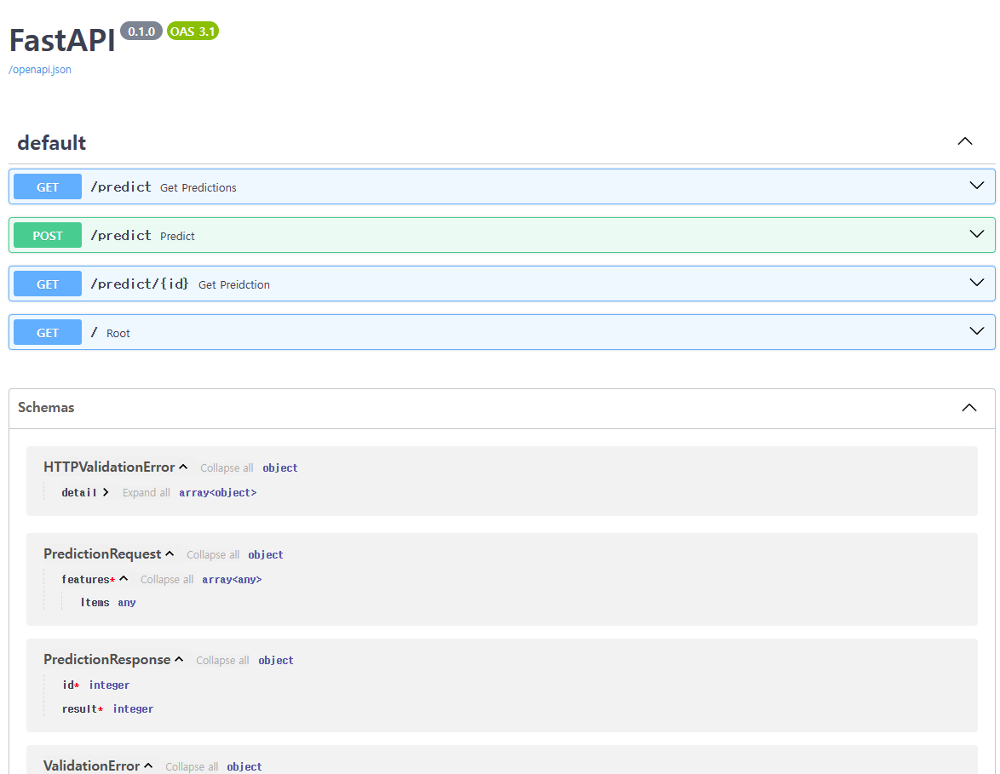
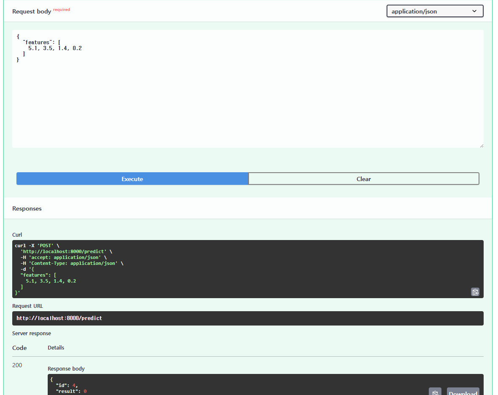
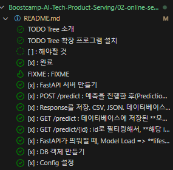

# FastAPI Web Single Pattern
- 목적 : FastAPI를 사용해 Web Single 패턴을 구현합니다
- 상황 : 데이터 과학자가 model.py을 만들었고(model.joblib이 학습 결과), 그 model을 FastAPI을 사용해 Online Serving을 구현해야 함
  - model.py는 추후에 수정될 수 있으므로, model.py를 수정하지 않음(데이터 과학자쪽에서 수정)

## 설치
- Python >= 3.9
- Poetry >= 1.1.4


```
poetry install
```

## Run
```bash
PYTHONPATH=.
python main.py
```

## Predict
```bash
curl -X POST "localhost:8000/predict" -H "Content-Type: application/json" -d '{"features": [5.1, 3.5, 1.4, 0.2]}'
```
```bash
# output
{"id":1,"result":0}
```

## Check in SQLite DB
```bash
sqlite3 db.sqlite3
.tables
select * from predictionresult;
.exit
```

## Get all predictions
```bash
curl "localhost:8000/predict"
```
```bash
# output
[{"id":1,"result":0},{"id":2,"result":0},{"id":3,"result":0}]
```

## Get a prediction
```bash
curl "localhost:8000/predict/1"
```
```bash
# output
{"id":1,"result":0}
```

## docs (Swagger UI)
```bash
localhost:8000/docs
```



`curl` 안쓰고 response 확인할 수 있음

## Docker Build
```
docker build -t web_single_example .
```

## Docker Run
```
docker run -p 8000:8000 web_single_example
```

---

# 시작하기 전에
- 나라면 어떻게 설계할까?
  - input을 GET으로 받아와서 model.py로 추론
  - output을 POST로 전송
- 마스터님(⬇️)과의 Diff 비교해보자
  - GET이 아니라 request로 input 받아옴!
  - GET은 POST로 DB에 저장한 output을 조회하는 데 사용

# FastAPI 개발
- FastAPI를 개발할 때의 흐름
- 전체 구조를 먼저 생각해보자
  - 파일, 폴더 구조를 어떻게 할까?
    - predict.py, api.py, config.py 등등
  - 계층화 architecture: 3 tier, 4 tier layer ...
  - Presentation (API) <-> Application (Service) <-> Database
- API
  - 외부와의 통신
  - 클라이언트에서 API 호출 => 학습 결과 return
  - **schema**
    - 어떤 형태로 데이터를 주고 받을 지 정의한다
    - 모델 예측에 대한 request, response
    - Pydantic의 Basemodel을 상속해서 정의할 수 있다
      - **payload**
    - * java의 Data Transfer Object (DTO)와 비슷한 개념
- Application
  - 딥러닝 모델이 예측 혹은 추론하는 실제 로직
- Database
  - 데이터를 어딘가 저장하고, 가져 와 활용
- Config
  - 프로젝트 설정 파일을 저장
- 역순으로 (config => database => application => API) 개발

# 구현해야 하는 기능
## TODO Tree 소개
- TODO Tree 확장 프로그램 설치
- [ ] : 해야할 것
- [x] : 완료
- FIXME : FIXME 



# 기능 구현
- [x] : FastAPI 서버 만들기
  - [x] : POST /predict : 예측을 진행한 후(PredictionRequest), PredictionResponse 반환
    - [x] : Response를 저장. CSV, JSON. 데이터베이스에 저장(SQLModel)
  - [x] : GET /predict : 데이터베이스에 저장된 **모든** PredictionResponse를 반환
  - [x] : GET /predict/{id} : id로 필터링해서, **해당 id에 맞는** PredictionResponse를 반환
- [x] : FastAPI가 띄워질 때, Model Load => **lifespan**
- [x] : DB 객체 만들기
- [x] : Config 설정

# 참고
- 데이터베이스는 SQLite3, 라이브러리는 SQLModel을 사용

# SQLModel
- FastAPI를 만든 사람이 만든 Python ORM(Object Relational Mapping)
  - 객체 => Database
- 데이터베이스 = **테이블**에 데이터를 저장하고 불러올 수 있음
- **Session**
  - 데이터베이스의 연결을 관리하는 방식
  - 외식. 음식점에 가서 나올 때까지를 하나의 Session으로 표현. Session 안에서 가게 입장, 주문, 식사
  - Session 내에서 데이터를 추가, 조회, 수정할 수 있다!
    - POST / GET / PATCH
  - Transaction
    - 세션 내에 일어나는 모든 활동
    - 트랜잭션이 완료되면 결과가 데이터베이스에 저장됨

## 코드 예시
```
SQLModel.metadata.create_all(engine)
# SQLModel로 정의된 모델(테이블)을 데이터베이스에 생성
# 처음에 init할 때 테이블을 생성!
```

```
with Session(engine) as session:
    ...
    # 테이블에 어떤 데이터를 추가하고 싶은 경우 add, commit, refresh
    result = ''
    session.add(result) # 새로운 객체를 세션에 추가. 아직 DB엔 저장되지 않았음
    session.commit() # 세션의 **변경 사항을 DB에 저장**
    session.refresh(result) # 세션에 있는 **객체를 업데이트**

    # 테이블에서 id를 기준으로 가져오고 싶다
    session.get(DB Model, id)

    # 테이블에서 쿼리를 하고 싶다면
    session.query(DB Model).all() # 모든 값을 가져오겠다 (all)
```

# SQLite3
- 가볍게 사용할 수 있는 데이터베이스. 프러덕션 용도가 아닌 학습용 (debugging 용도)


# 현업에서 더 고려해야 하는 부분
- Dev, Prod 구분에 따라 어떻게 구현할 것인가?
- Data Input / Output 고려
- **Database => Cloud Database(AWS Aurora, GCP Cloud SQL)**
- API 서버 모니터링
- API 부하 테스트
- Test Code